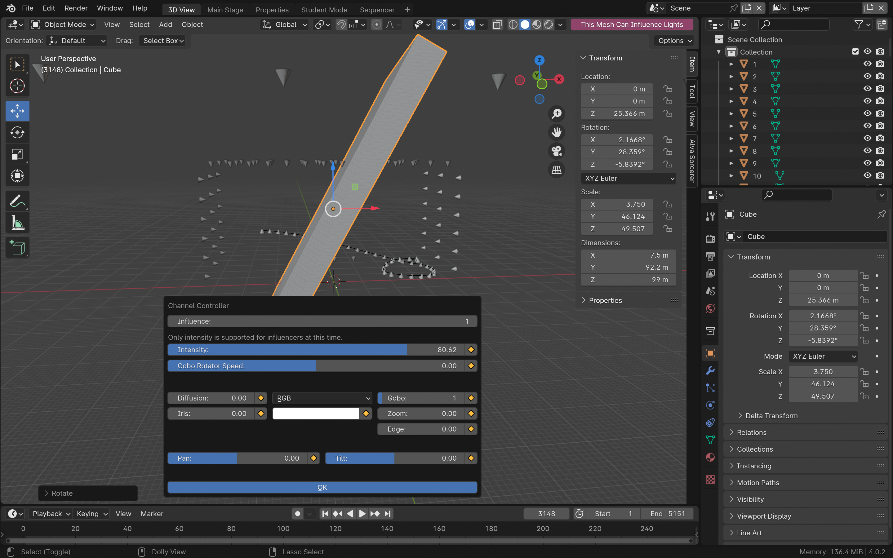

Make 3D shapes influence lights
============================================

**CHANNEL MESH NAMES MUST BE INTEGERS REPRESENTING THEIR CHANNEL NUMBER FOR THEM TO PARTICIPATE!**

With Sorcerer, you have access to *dynamic spatial selections*, or “influencers”.  You can use a cube (or other simple 3D shapes) to make dynamic selections that change over time throughout a sequence. The cube has its own lighting parameters. When the cube passes over lights in 3D view, the lights inherit the cube’s parameters. When the light is no longer within the cube, the light is released back to its background state. 

This allows you to, with enough fixtures, make it look like invisible objects and shapes are moving throughout the theater. You can even use Blender’s physics simulations to make it look like cubes are colliding with each other or bouncing on the ground.

This also provides you an extremely intuitive way to create some simpler effects. If you want it to look like an effect is moving across the stage, you simply animate the effect to move across the stage. No syntax required.

To activate a mesh object as an influencer, select it and make the button in the 3D view header that says, “Make this Mesh Influence Lights” go red by pressing it. Then, use the channel controller side panel on the N tab or the keyboard shortcut popup editor (P key for Properties) to edit the cube’s parameters as if it was a lighting fixture itself. Use Blender to add animations, constraints, physics simulations, and other effects. 

Note: Currently, influencers can only influence intensity. Also, they cannot yet do fade up or fade down. We're working on it.

Channel controllers
------------------------------
Select any light in 3D view (represented by cones) and hit "P" to open a popup controller to control its individual properties. This also works for influencers. You cannot yet select multiple cones and edit them at the same time. This is primarily intended for commandeering individual lights, not for making changes to multiple lights at a time (use nodes or strips to do that). 

Note: Blender's orientation widgets for the cones do not yet actually control pan and tilt on the console. Right now, the only way to constrain a lighting fixtures pan/tilt to an empty is by using an animation strip.

Note: The color profile (and other parameters) for the channel controller is scene-specific, so you cannot animate color anywhere but in animation strips in sequencer (and those don't have color profiles at all, they can only do RGB at the moment). 

