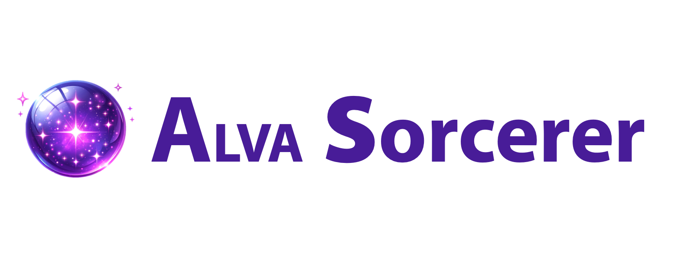

Hello there, human!
===================================

**Alva Sorcerer** is a Blender add-on that uses OSC to remote-control universal lighting consoles, but primarily ETC Eos consoles. Sorcerer is intended for anyone with access to a lighting console (or activated lighting console software like ETC Nomad) who likes the lighting console and definitely wants to keep the lighting console, but wishes the console was a little more user-friendly. Especially while trying to focus on art and emotions instead of technical concepts. Alva is useful for cue building and especially useful for timecoding. While it can be used as a busking assistant, Blender and Sorcerer are not Performance-rated, so we recommend only relying on them during design time, not during the final performance with an audience.

Sorcerer is also intended for someone trying to create ALVA technical theatre designs. ALVA stands for Animated Lighting, Video, and Audio. Currently, Sorcerer is capable of animating stage lights and 3D audio objects at the same time. This means you can make a mover track a 3D audio object moving through the house. It also means Sorcerer can connect you to the animation powerhouse that is Blender, allowing you to create extremely sophisticated lighting animations—through existing lighting consoles you already have. Once a design is perfect, it can be saved onto the lighting console as a “qmeo” to be played back almost like a video, without Sorcerer.

Alva Sorcerer Documentation Objectives:
----------------------------------------
The Alva Sorcerer Manual is not about lecturing you on how Sorcerer works. That's boring. We try our best to design the software to be intuitive enough that you don't need to read the manual to be happy with the software. If you contact us thisisdumb@alvatheaters.com about a dumb part of the UI, that tells us what parts are the most dumb that need the most improvement. We're not going to solve those problems with better documentation, we're going to solve those problems by making the software less dumb. In fact, the phrase, "RTDM" is banned at Alva Theaters. It the software's job to make the manual pointless. Have you ever had to read the software documentation for your phone? If you did, would you be happy with your phone? We believe Sorcerer can be and should be smart enough that it just does exactly what you expect it to do—because it could not possibly be any more simple.

This manual will focus on how to help you do more cool stuff. This documentation is here to seek to provide you with guidance on how Sorcerer can help you:

.. toctree::

   nodes
   audio
   cube
   patch
   strips
   school_mode
   others
   glossary
