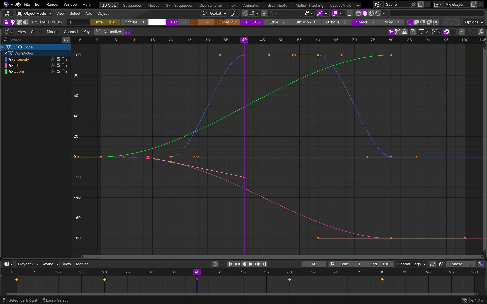

.. figure:: ../source/_static/sorcerer_logo.png
   :align: center
   :alt: Sorcerer
   :width: 300px

Hello.
===================================

**Alva Sorcerer** is a Blender add-on. It brings exhaustive 3D animation tools to lighting and spatial audio design for the stage. Unlike traditional stage technology, which focuses on unpredictability and manual operation, Sorcerer focuses on subtle emotional expression. It’s designed for artists who want emotional resonance in timecoded technical sequences. 

Traditional tools prioritize adaptability and consistency, like shaping a vase on a lathe as it spins. For example, effect engines do not allow a change to be made to only a specific iteration of the effect. Sorcerer, in contrast, sculpts a stationary statue. Each fixture, each parameter, each second can be uniquely crafted. For example, the user may tell the 174th iteration of a chase effect to skip a specific fixture and only on that iteration. Furthermore, 100% of interpolation curves are fully exposed and controllable at all times.

The modern stage lighting console starts with the foundation of one of those old DMX512 fader boards the size of a loaf of bread. This incurs foundational constraints hidden so deep they are invisible. Sorcerer starts with the foundation of Blender, inheriting no such constraints. This permits a new world of wild and bizarre possibilities.

How do I download and install?
---------------------------------
https://sorcerer.alvatheaters.com/download

How do I patch lights?
-------------------------
Sorcerer does not have a patch page. Unlike a DMX controller, Sorcerer is a remote-control for existing, professional lighting consoles like ETC Eos and grandMA3. Sorcerer will remotely-commandeer ETC Eos to sync animation and sequencer data onto the console. Is currently not supported for remote data syncing.

How do I connect speakers?
------------------------------
Sorcerer cannot connect to speakers directly. It instead remote-controls Qlab for live monitoring. For final deliverables, it outputs sound multiple files that require no metadata. These sound files are then imported into Qlab for local playback. The speaker-specific volume mixing is baked into the audio files for each speaker.

How do I make a fly-out effect?
---------------------------------------------------
A complex, custom fly-out effect can be achieved in 26 seconds once Sorcerer is connected to a console with a mover patched. 

1. Enable auto-keying mode.
2. Press "I" while hovering over Intensity, then while over Tilt, and then while over Zoom.
3. Step forward to frame 20.
4. Set Tilt to -5. This will give the fly-out a running start.
5. While hovering over Intensity, press "I".
6. Step forward to frame 40.
7. Set Intensity to 100.
8. Step forward to frame 60.
9. While hovering over Intensity, press "I".
10. Step forward to frame 80. 
11. Set Intensity to 0, Zoom to 100, and Tilt to -80.
12. Open a Graph Editor to adjust the speed, scale and interpolations.
13. Apply to other fixtures by setting the target from "1" to something like "1-5", or by copy/pasting the keyframes to a different object.
14. If using ETC Eos, create a Qmeo to store the animation onto the console for local, reliable playback.

Documentation Objectives:
----------------------------------------
This manual is here to make exciting things happen faster, to help you:

.. toctree::

   nodes
   audio
   cube
   patch
   strips
   school_mode
   others
   pythonize
