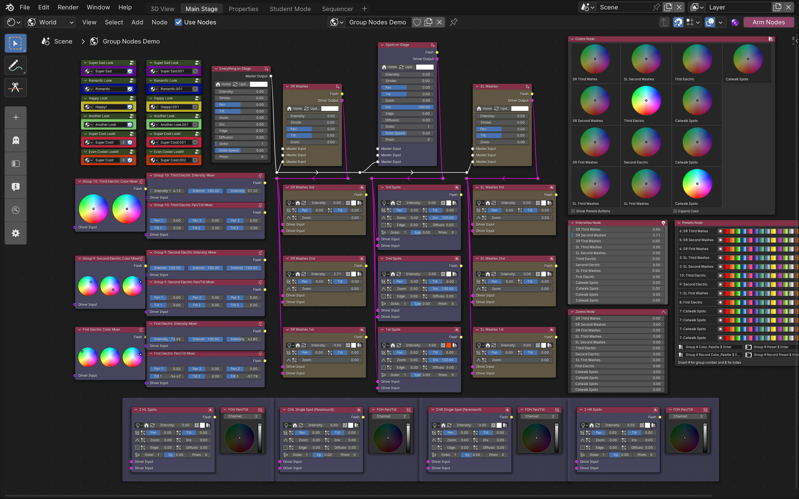
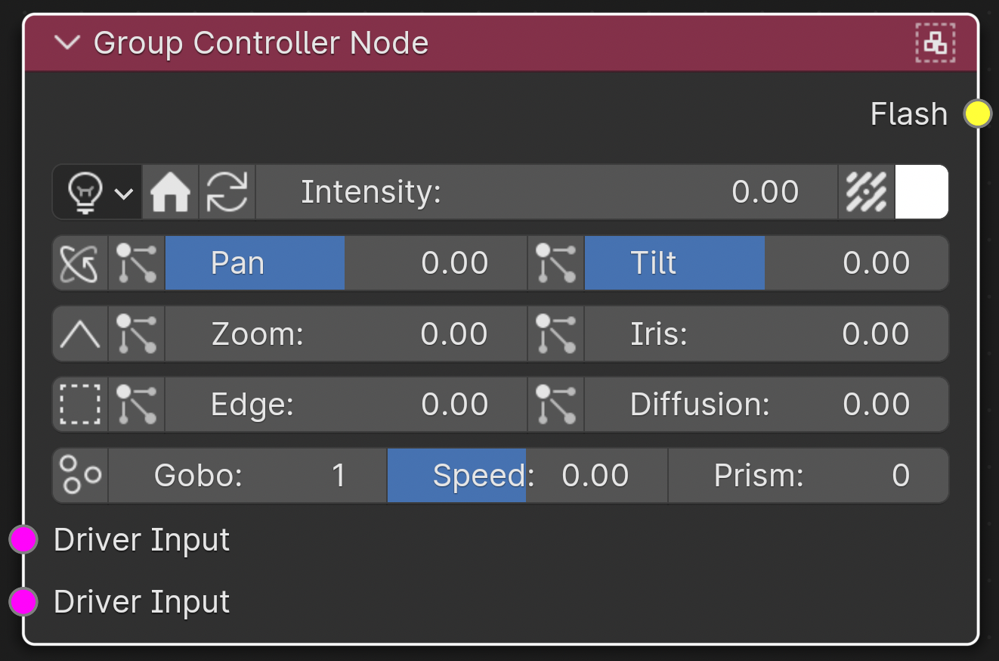

Never select a group of lights again, with nodes!
====================================================================
Sorcerer introduces the concept of node-based light design, where the word “selection” is a thing of the past. Sorcerer allows a lighting sculptor to manipulate a lighting rig as if it were a sculpture. To change a parameter, just change it. There is no need to make a selection first. 

A reason other consoles/software cannot work this way is because their UIs are not efficient and customizable enough. Providing the user with multiple ML editors, one for each group, would quickly clutter the workspace to the point of chaos. Sorcerer solves this problem by using a node editor to organize controllers. Nodes can be renamed, panned, resized, colored, and collapsed into groups (and other groups can be collapsed inside those groups.) The user can create hierarchies of controllers consisting of drivers and masters, where drivers control multiple groups and masters control drivers. The user can pan around and zoom in and out of the workspace. It starts as a completely empty canvass. The user can add as many or as few nodes as desired. Each workspace can easily be duplicated to form libraries of layouts. Node groups can be marked as assets and sold on existing marketplaces. 

The Sorcerer UI components were designed using only a 13” laptop screen.

Group controller nodes
---------------------------------

These nodes control a single group. Select the group to control in the top lefthand corner. They provide instantaneous access to the most common parameters. They are compact enough to have dozens of them on screen at once. Toggle the visibility of any parameter on any controller by hitting the F key to reach the format menu. There, you can also control the custom color. All nodes can be resized on the x axis, but not on the y axis. 

Use these if you are tired of traditional-style ML Editors that can only control one thing at once, take up half the screen, and require you to scroll this way and that way to access basic functions that really should be right next to one another with pictural icons. The Sorcerer group controller nodes were designed to minimize LPCI (Lazy Pixel Count Index) at all reasonable costs. PLCI is a mathematical calculation that quantifies the precise number of pixels on screen at any given time that do not serve a purpose.  

To ensure universal console compatibility, Sorcerer’s node editor makes use of user-defined OSC templates. The user supplies verbiage specified by the console manufacturer for controlling the parameter and Sorcerer provides the group/channel number and parameter value. The user tells Sorcerer where to place the group/channel number and the parameter value with the symbols “#” and “$”, respectively. This is similar to how the sequencer uses the “*” symbol to automatically insert strip length into macro commands.

A primary point of differentiation between Sorcerer, which is remote control software, and DMX software is how fixture libraries work. Sorcerer does not have access to fixture libraries (yet), so the user must select which fixture groups have which capabilities. (Note: Sorcerer is not explicitly compatible with many more advanced fixture capabilities, although some of these can be accessed by modifying the group-specific OSC templates.) Do this with the view toggles in the format menu, and then when necessary (for capabilities like strobe), adjust the templates based on what the console prints to the command line when the parameter is changed on the console. Use the # and $ symbols in accordance with the tooltip instructions. These settings are accessed by pressing the icons to the right of the parameters. 

Because many parameter templates do not vary from fixture to fixture (intensity and iris for example), these templates are not found in the individual group controllers, but rather in the scene-level node editor and channel controller settings. Parameters that will require different templates for different fixture types (strobe for example) have their OSC templates stored on the individual nodes, accessed through the icon buttons. Other parameters, like zoom, also provide the user the ability to set min/max at the controller level. For the channel controller in 3D view, min/max is set across the scene universally. Min/max does not directly impact the numbers seen on sliders; rather, they impact how the slider value is mapped before being sent to the console. Many slider values only operate between 0 and 100, but the min/max allows the user to map the 0-100 scale to a custom background range. This is different from min/max in the sequencer’s animation strips, which do allow the user to directly manipulate the min/max seen on the slider itself. This change was made partly to minimize the quantity of buttons on the more compact node layouts.

All of the following node types can be accessed from Shift + A, the Add menu at the top, or by right-clicking. While Sorcerer does offer a customized node editor area where only Sorcerer nodes can be added (to exclude irrelevant modelling/shading/compositing nodes), group nodes are not compatible in that space. If you are not planning to use group nodes, the Sorcerer Nodes view may be best.

Group driver nodes
----------------------------------------
These nodes are like group controller nodes but are less compact. They control multiple group controller nodes at the same time. This allows the user to create elaborate hierarchies of nodes. A Group Driver node output socket, in the upper right-hand corner, can be connected to many group controller nodes. Operating the driver will operate all downstream group nodes the same way. A group controller’s input Driver Input node however can only connect to a single node upstream (this seems to be a Blender limitation). For this reason, multiple input sockets are provided at various points throughout the UI.

These nodes, in addition to the mixer driver nodes, do not have group targets in the top left corner since their targets are defined instead by sockets and noodles.

Master nodes
----------------------------------
These nodes are like group driver nodes, but drive the driver nodes, not group controller nodes. You should never attempt to connect a white Master Node socket to a socket of any color, like the pink Group Controller sockets and the purple Mixer Node sockets. It will connect, but the color of the noodle (the curvy line connecting sockets between nodes) will fade between the colors across its length. Within the context of Sorcerer nodes. seeing this color mixing effect on a noodle means there is an invalid connection. It may draw an error message. 

Master nodes are primarily intended to be used to remotely access collapsed group driver nodes hidden away inside group nodes. 

Group nodes is a group of nodes that can act as a completely different world. You create groups with the right click menu. (Note: this only works in the Shader Editor, not in the Sorcerer Nodes view.) Once you have created a node group, Blender automatically tabs you into the node group’s world. You can use the two green nodes on the right and left hand side to connect to white sockets within the group node world. (Note: Currently, only connect to the white sockets, not sockets of any other color.) Once noodles have been drawn between the group input node sockets and white sockets on controllers you wish to control from the outside (you can label and reorder these on the N tab to the right, at the top), hit the tab key to exit the node group. Then, connect Master Node outputs to the green node group node’s white sockets. Then, remote-control the hidden nodes with the Master Node.

Flash nodes
--------------------------------------

Here is an example of a potential flash node setup being used for lighting choreography. This type of setup allows you to rapidly change parameters inside increasingly complex sequences without getting confused by complicated computer lingo and spreadsheets. Use color coding, noodles, and visual organization to stay on track of what settings are where. Note: to make the noodles do the fancy arrow thing, hold down Shift, right click, and drag over multiple noodles. To move an anchor point, click and and hit G to grab.

The details on how this all works can be found in the sequencer section that talks about flash strips.

.. figure:: ../source/_static/flash_node_setup.png
   :align: center
   :alt: Flash Node Setup
   :width: 700px

Here is what it looks like when you "tab into" the green "group node":

.. figure:: ../source/_static/flash_collapsed_group.png
   :alt: Group Node for Flashes
   :width: 700px

Mixer nodes
---------------------------------------
These nodes can be used to mix two or three different parameter choices across a group. They can toggle between Intensity, Color, and Pan/Tilt. They can either fan the choices across the group, or when the middle selection is hidden, they can alternate two selections. This is particularly useful for adding 2 alternating colors to effect lights. The boring settings part of the mixer node can easily be hidden with the eye icon. To bring them back, bring up the format popup with the F key. To create a mixer that controls both intensity, color, and pan/tilt for a group, the settings can be toggled off and three different mixer node can be stacked in top of each other with minimal wasted space in between. A node will only change its layering if the node is fully selected. Simply changing a slider or color will not layer a bottom node to the top. Changing the underlying settings of the node, like parameter type or group target, will however, and you will need to click the bottom, then the middle, then the top to restore the correct layering.

Mixer driver nodes
--------------------------------------------
These nodes work exactly the same way group driver nodes do, only they do not currently have master input sockets, so they cannot be accessed remotely when collapsed inside a group node. These nodes, in addition to the group driver nodes, do not have group targets in the top left corner since their targets are defined instead by sockets and noodles. 

Group data system
-----------------------------------------------
A problem you may encounter when you first start is zero groups are available in the top left corner of the mixer and group controller nodes. To add groups to the scene’s group data, either navigate to Blender’s properties viewer, put it in full screen, navigate to World, and then find the “SORCERER: Group channel blocks (full screen)” section. Here, you can manually add and modify groups with their channels. Groups you create here will then be accessible from the group controller/mixer top left group target drop down. 

Another way to create these groups is the USITT ASCII import system, accessible in the Alva Sorcerer section of the N tab on the right of the node editor, as well as the Patch function beneath that. (The Patch function is only visible in Eos console mode, toggled in the node settings.) The USITT ASCII import system takes a USITT ASCII file created by some lighting consoles, including ETC Eos, and adds all the lights to the 3D scene (if location/orientation is provided in the file) and automatically creates all the group controller nodes in the node editor, placing them in positions on the node editor canvass roughly consistent with any available position data. The Patch function is discussed later.

Single-parameter nodes
-----------------------------------------------
These nodes provide instant access to the specified parameter of all group controller nodes at the top level in one compact place. They do not include the parameters of nodes hidden inside group nodes, and they don’t yet limit their scope when they themselves are inside a group node.

Renderer nodes (qmeo nodes)
------------------------------------------------
These nodes are responsible for exporting animation data created by the node editor in a format that the lighting console can store and play back locally. These are called qmeos. Qmeos are like videos, only each frame is a lighting cue instead of a picture. Time is preserved by binding every cue to the correct frame in an event list for a timecode clock. All this work is done automatically by the Sorcerer orb, through these renderer nodes. 

All parameters accessed in the node editor (except color, for the time being), can be animated at any time for any reason. This means you can import music, scrub to any point in the music, bind any parameter to any value, scrub to another point and immediately bind the parameter to a different value with a keyfame, use graph editor and dope sheet to acutely finesse the shape of the interpolation curve, and also use the dope sheet to duplicate and shift these curves around, and then expect Blender/Sorcerer to remember this and also be able to then automatically store it onto the console’s hard drive—without wires. All this can be achieved with Sorcerer without the need to first create an animation strip and then select the group to be controlled. Instead, you can immediately keyframe any parameter at any time always (except color, for the time being). Remarkably, this is not achieved with alternative DMX software, but with a remote-control software compatible with theoretically any professional lighting console, particularly including ETC Eos. 

Because the node editor’s version of the qmeo maker relies exclusively on user-defined OSC templates, it is (likely) compatible with at least most professional lighting consoles, and certainly with ETC Eos. 

Note: The algorithm that the Renderer Nodes use is significantly more advanced and quick than the much older algorithm the animation strips use over in sequencer. For example, the node editor version only requires one single pass compared to sequencer’s two. 

To use these nodes, simply follow the tooltips. The correct syntax for ETC Eos is auto-filled by default. If using a different console, study the Eos syntax for an idea on what type of information is expected/needed. Research your console online to find its version of the syntax.

Console buttons nodes
------------------------------------------------------------
If the Console Buttons node is so confusing that it requires reading the documentation, please write a complaint to thisisdumb@alvatheaters.com or submit a bug report. Yes, that would be considered a bug.

Presets nodes:
------------------------------------------
Use these nodes to rapidly record and recall presets. Soon, we will fix the issue where the numbers no longer draw correctly past a certain zoom level. Use the index offset number to make the preset numbers start at a number other than 1. This is useful if you have multiple preset nodes at the same time or if you are only allowed to occupy certain ranges to share space with others. 

Pan/Tilt nodes:
-----------------------------------------
Use these nodes only for controlling the pan/tilt of conventionally hung, FOH movers. They are specifically designed only for this purpose. Using them for movers hung in other orientations will likely lead to less-than-intuitive results. 

Why are they color pickers? Because Blender’s Python API provides color pickers to addon developers. Another reason is that movers spin, spinning is circles, so using a circle to control pan/tilt seems more intuitive than using a square.

When these nodes are used for the proper movers, the interface could not possibly be more intuitive. If a mover is hung very deep into the house, hold down Shift while moving the dot. Be sure to release the mouse **before** releasing Shift, or it will jump away. 

These nodes incorporate a system that allows the circular color picker to represent the additional range of pan rotation most moving lights provide that pass 180 degrees in each direction. This means that when you pan the mover from the front to all the way in the back, the gimbal can usually continue rotating. A normal color picker controller would face a serious problem here since a circle cannot represent more than a circle. (The ideal shape here would be more of a helical disk with 150% the surface area of a circle of the same scale.) Sorcerer solves this problem by activating a sort of “overdrive” mode whenever it detects that the user wants to pan either direction more than 180 degrees. This overdrive remaps the color picker so that it can represent the true rotational range of the gimbal (it is hardcoded to 270 degrees, so an extra 90 degrees both directions). The Pan/Tilt node will display a red message below the color picker to indicate that this mode has been entered. When the dot gets close enough to 270 or -270 degrees, the pan-around point, the node will add a second message under the original notification stating that the fixture will soon pan-around (due to the mechanical limitation of the gimbal). After pan-around has been reached, the “overdrive” mode is exited and the messages clear. 

The vertical slider on the right of these nodes controls scale or sensitivity. Raising it all the way up will have no effect on behavior and lowering it will make control inputs have less effect and it will be easier to fine-tune the position.

In the future, these nodes will include an enumerator (drop-down) to change between different hang modes, between upside down/right-side-up/side hung and facing either which way. Right now, the experience is perfect, but exclusively for the most common use-case.

Toolbar buttons (node editor)
-----------------------------------------------
Most of these buttons currently only work ETC Eos. This should soon change to use templates defined in settings instead of the hardcoded messages.

For details on Blender-specific node organization features, refer to the Blender community or Blender’s documentation.

