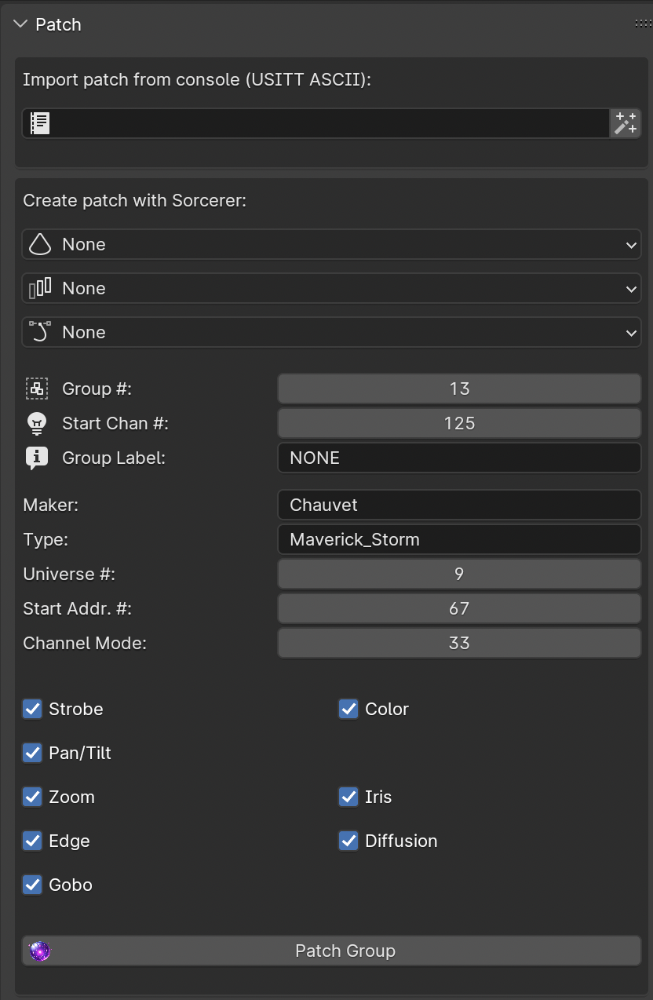

Patch Eos visually using cones
===============================

Usually, the patching process for DMX software starts at the patch page. In Sorcerer, it starts at 3D view. That is because Sorcerer is designed for the artist, not the stage technician. Art is not restricted by technicals. With Sorcerer, go to 3D view and place fixtures wherever you want without patching. Fixtures are represented by simple cones. Label, rotate, and color the cones as desired. Use array modifiers to rapidly create large groups. Constrain the array modifier to curves/splines/shapes if they aren’t supposed to be in a straight line. Duplicate groups to maintain consistent locations. Then, go into the node editor to create them on the lighting console. Instead of using multiple lines of syntax, write out all the details for the patch at once, review all at once, and hit the Patch button. The Sorcerer orb will create the channel, patch the DMX, position and orient the light in Augment3D, create a group, label the group, and leave the new lights selected so they are highlighted in Augment3D. Finally, the orb will create a group controller node for the new group with the group’s view toggles set for the group’s capabilities. 

If you don't want to or need to ever think about the universe and addressing, just leave it at 1 and 1. It will take care of the rest for you, being careful not to patch anything past address 512. It will automatically increment everything appropriately. 

Note: There is a known issue where addressing information is occasionally missing on the console once every 100 lights or so. You can easily fix this on the console itself. We're not sure yet if this is a Sorcerer issue, an Eos issue or a network issue. By EOD, Sorcerer will switch to using TCP for these systems instead of UDP. That will make these administrative tasks much more reliable.
