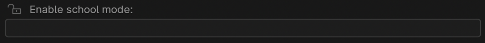

Prevent students and/or volunteers from messing with stuff
=============================================================

Find this in either settings panel, either in the Shader Editor (node editor) or in the sequencer. The password is "password123".
