Use a video editor to timecode on Eos without any cables
==============================================================================
There are many DMX softwares out there that can do sequence-based light design. For existing lighting consoles, the user can use sophisticated, wired timecode systems that connect the console to DAW’s, CDJ’s, Resolume, and other FOH system components. Sorcerer, which is not a DMX software, uses wireless OSC commands to synchronize Blender’s video sequencer to the timecode clocks in ETC Eos consoles. When the user places various strips inside the sequencer to control lights, the sequencer deletes, then rebuilds the console’s event list with macro and cue calls based on the strips inside the sequencer. This means that all events are always stored directly on the console, directly in the event list. The only difference is how they got there. This works because compatible strip types in the sequencer, such as flash strips, use macros to achieve effects. Instead of requiring the user to manually create the macros, the Sorcerer orb automatically creates the macros. 

All the “media” settings for the below strips can be accessed from a popup with the M key. They can also be accessed on the side N tab. 

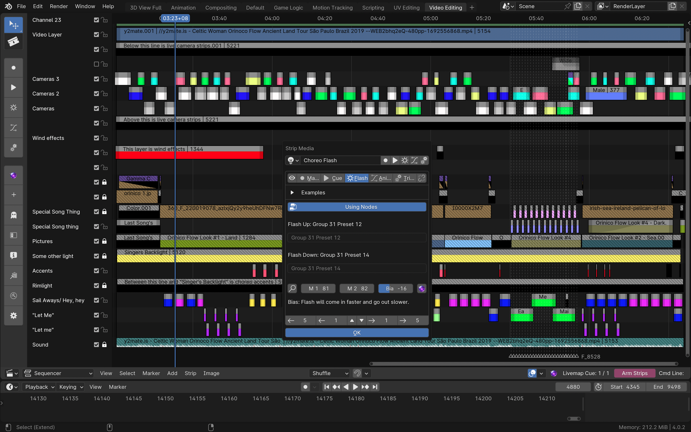

Flash strips
-----------------

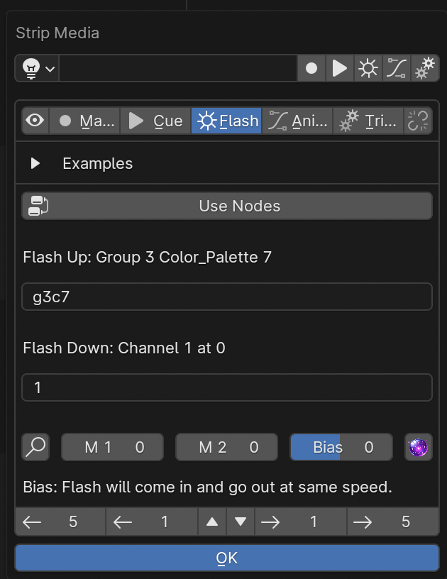

The sequencer provides 5 different strip types, as mentioned above. Flash strips allow the user to rapidly take a value up, then down, with minimal effort. The length of the effect is defined by strip length, which is a common theme. Changing a “bias” setting can make the beginning faster than the ending, or vice versa. Plain English is used to define these effects. A background algorithm attempts to guess what the user meant and displays the syntax it will actually send to the console for the user to review. This means typos and lazy shorthand is rewarded by the software. It is the software’s job to read the user’s mind. It’s for artists, not “pro****mers”.

**How to connect flash nodes to flash strips:**
You may wish to connect flash nodes to flash strips if you have a complex choreography involving numerous steps, each with distinct parameter changes. While this can be achieved and maintained conventionally without any nodes, the nodes help you visually keep track of what is happening on every step and they provide you with means to instantly change any parameter on any step. To do it, connect a Flash output socket (yellow dots on the top right that say “Flash”) on a group controller, mixer, or driver node to a Flash input on the bottom left of a flash node. Flash Up means this controller should dictate what happens when the strip starts, Flash Down means this is what should become active when the strip starts going out. Then use the interface there to record presets on the console to store the preferences of the group controller/driver/mixer nodes plugged into that socket. Then, go to the sequencer and create a motif name on all the strips that should be associated with the node. “Motif name” is the name input at the field. Use the “linking” function as well as the “Copy to Selected” button, as well as the Strip Formatter (F key) to speed up this process and keep them linked together. Then, press the “Use nodes” button on the flash strip(s) to make it blue. Then, go back to the node editor and find that motif name in the drop down at the top of the flash node. Now, the flash strip read-only output (the text field above the input that reads out what it’s going to send to the console) should reflect the group and preset defined by the nodes. This way, it is far easier to maintain complex choreography routines without getting confused by needing to remember so many different numbers. Then, optionally collapse large flash node effects systems into group nodes and then tab in and out of them so they don’t create clutter when not being used.

Macro strips
---------------------

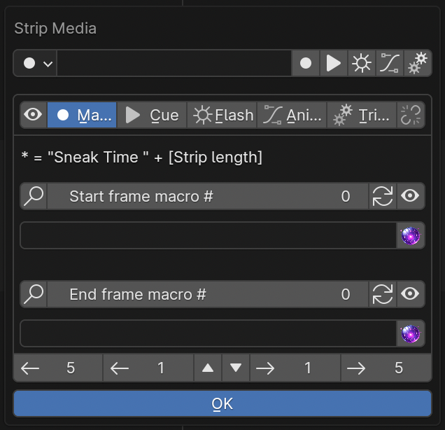

Macro strips are similar to flash strips but allow the user to define explicit macros to be sent on the strip’s start and end frames. If desired, the user can add “*” to have Sorcerer automatically fill in “ Sneak Time [strip length] ”. These also try to correct typos, but this algorithm is more restricted since it is not aware of the full Eos macro vocabulary. (Future versions of Sorcerer may include an intellisense/autocompletion type of system here that would predict and display the next most likely word. Such systems are common in software development IDE’s. This feature however has not yet been built.) Creating single-line Eos macros with macro strips may be preferable to creating them through the Eos UI if a user simply wishes to spell out a known macro command with letters rather than trying to search for each individual word in a massive library of words. Oftentimes, it’s simpler to just spell it out. A common “gotcha” here is forgetting to add underscores (“_”) between the words of multi-word keys. Unlike flash strips, macro strips will not automatically add “Enter” at the end if it is forgotten since sometimes it is left out intentionally in this context. 

Cue strips
-----------------------

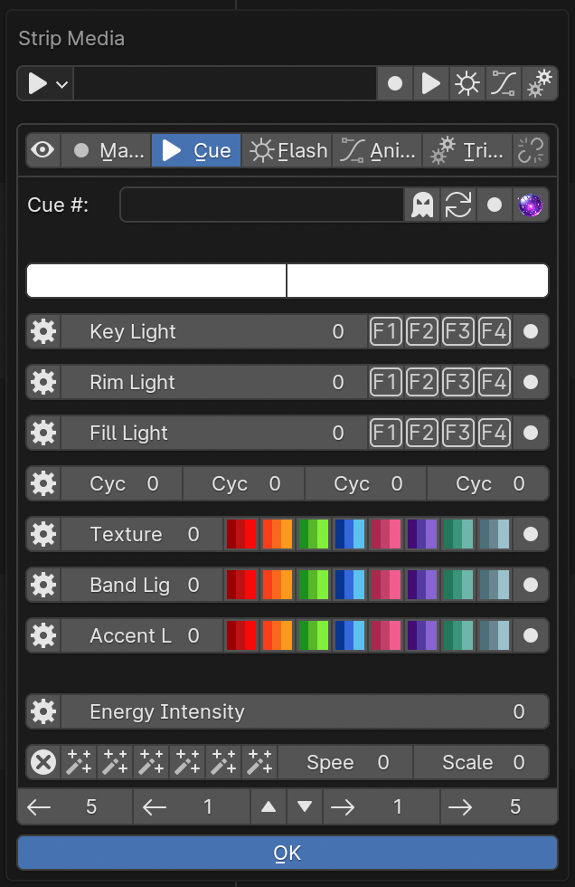

Cue strips allow the user to type in cue number in text format and use the strip length to define the cue duration. The user can then use a combination of the console itself, the node editor, and the cue builder feature built into cue strips to build and record the cue. The cue builder feature is there to provide rapid access to traditional, academic theatre lighting structure like rim light, key light, wash light, texture light, accent light, cyc light, and accent light. This feature is primarily intended for musical contexts. If a theatre setup uses zip strips and gels to light the cyclorama with colors, the software can switch to using 4 separate intensity sliders to mix cyc color. For lighting types likely to include color, like cyc, accent, band, and texture light, the user can rapidly record and recall presets identified by colors. For lighting types not likely to use color, rim light, key light, and wash light, numerical icons are provided instead of colored icons. However, they relate to presets just the same, which can still control all palettes to include color palettes. These are primarily intended for focus/beam information. 

Change what rows control what groups by pressing the gear icon to the right of each row. This will open a popup where you type in the group number(s).

Trigger strips
-----------------------

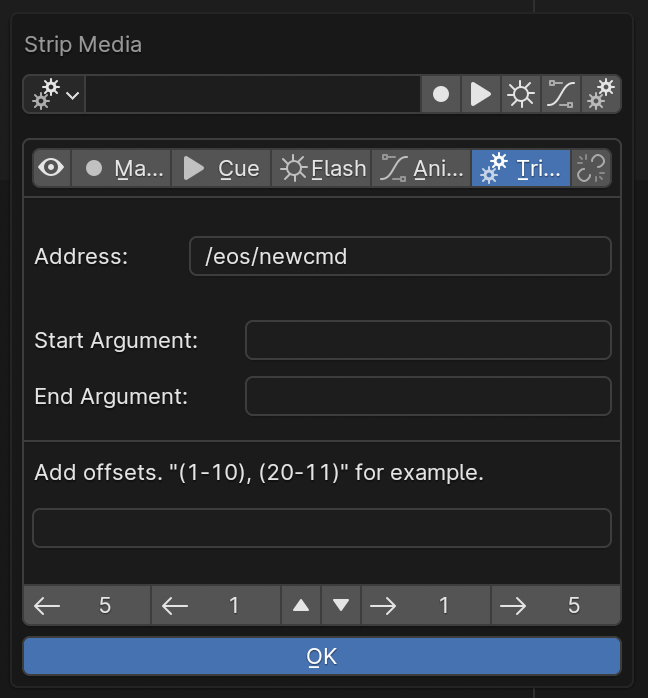

Trigger strips allow the user to write out purely arbitrary OSC strings to be sent on the strip’s start and end frames. They also allow the user to create advanced offset effects using the “Add Offsets” text input field. Start by defining the first thing that should happen in the strip’s start frame field. For example, “Channel 1 at full enter”. Then, write out the channels that should be considered in the group of channels that should do stuff (Note: this technically works with lists of groups as well): “1-20”. When you play through the strip, channel 1 will come up to full, then 2, then 3, and by the end of the strip, all 20 channels will be at full. To add a fade up, simply add a “sneak time” to the start frame field. To make this happen in reverse order, simply reverse it. To add multiple lists, add things like “1-20, 30-20, 50-60”. All these channel lists will be added to the offset in sequential order. To make multiple lists fire at the same time, simply separate the lists with parenthesis (). This tool doesn’t only work with intensity. Many other similar requests will also work. However, it is possible to confuse the algorithm with complex inputs. Note: multiple lists inside parenthesis only works properly when the lists have the same quantity of channels.)

Animation strips
--------------------------

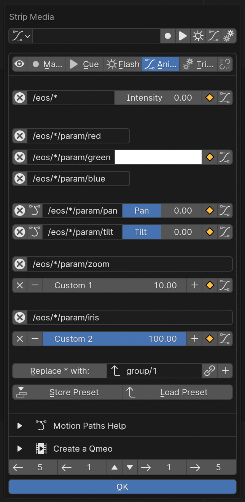

Use animation strips to make people feel sorry for lighting fixtures. Use them to make it seem like individual movers have feelings. Bring stage lights to life for your audience. Achieve this with Blender’s performance capture technology, linked to the stage by Sorcerer. If you aren’t satisfied with a predefined, linear fade curve from the lighting console, spends hours finessing the fine details of a single curve in the graph editor. If you have a series of multiple lighting animations, consider using the Nonlinear Animation Editor to better organize them. To rapidly reproduce and drag keyframes, find them on the timeline view. Once you have a complete animation sequence, create a qmeo so that console can play it back by itself (without Sorcerer).

Note: we realize this doesn't actually help much. When we have the time, we will make this section much more helpful. It's difficult to explain some of the more advanced features in writing.

  
How to do performance capture
-------------------------------
Film a video of yourself pointing a laser pointer around a flat vertical surface in an expressive way, perhaps to music like Hans Zimmer’s “S.T.A.Y.”. Pretend like you are a living, breathing moving light that has feelings. Put those feelings into the movement of the laser pointer. Then, load the footage into Blender’s motion tracking area. Then, use common Blender tutorials to help you track the laser pointer light to an “empty”. Then, use an animation strip to constrain a mover to the “empty”. Finally, once it seems right, use the animation strip to create a qmeo so the console can remember how to play it back without Sorcerer. 

While we don't yet have a detailed, step by step tutorial for this, here are some notes from the proof-of-concept project that successfully demonstrated this technology:

1. Use object tracking, not camera tracking.

2. Blender will yell at you if you try to track just the one empty, so place at least 7 other trackers on stationary objects. This will lead to absurdly high solve error, but that's okay because we are only tracking a single point in space, not an  object.

3. Try to film with the quickest shutter speed possible to minimize "light painting" distortion when the laser pointer moves faster. 

4. If you accidentally filmed upside down, you have to either put up with it or render a new one with the sequencer. The movie clip editor cannot rotate the clip as far as we know.

5. If you get it mostly working (that is, the motion tracker is translating its data to pan/tilt on the console), but the movement is super small on the fixture and you'd like it to be more exaggerated, you need to go to the light's Track To modifier and hit Constrain to F-Curves. This will take a couple seconds to complete, depending on the length of the sequence. Once finished, you can see all the kyframes in the graph editor and resize them as needed with G for grab and Y for constrain to Y axis. Be careful not to scale it up so much that you run into pan-around on the mover's gimbal.

6. Refer to the many general Blender tutorials available on YouTube for more step-by-step specifics on how to do the basic motion tracking component.

7. The initial tech demonstration test was done under suboptimal working conditions with suboptimal tools. This resulted in nonviable artistic output. However, the demonstration successfully validated the performance capture technology for theatrical light design using publicly available software. While the results of the tech demonstration are not artistically viable, future implementations with better tools and working conditions are expected to yield higher quality results.

Strip formatter
--------------------

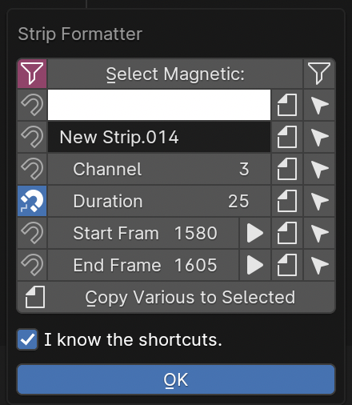

The strip formatter is available on the F key as a popup. Use it to rapidly format multiple strips. Consult the tooltips for details on the many buttons.

Audio strips
--------------------

This is the Audio Formatter popup, specific to audio (or video) strip selections. Use the Set Range and Zero Timecode buttons to rapidly set up the scene for the new song. There is also a tool there for rapidly adding many color coded strips on each beat of the song, based on time signature and BPM. Once you create an army of color-coded strips, select all strips of each beat by using the regular strip formatter. Set the magnet to filter for the length and color, then hit Select Magnetic with the filtering icon not red to select all those strips. (Yes, the whole "Select Magnetic" filtering thing is really confusing. We'll make it less dumb when we have time.)

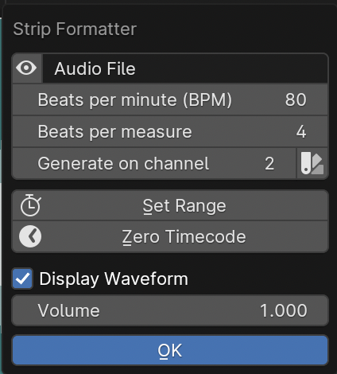

This is the Audio Media popup, specific to audio strip selections. Use this to tell Sorcerer what timecode clock and event list to use for the event list and timecode clock management "Render Strips" button and play/scrub/stop synchronizer. Then, if desired, automate the creation of the cues and macros you'll need to start and stop the timecode clocks from the Eos console, since that process can be difficult to learn and remember. Note: The cues you use here must already exist on the console or the console will get upset. 

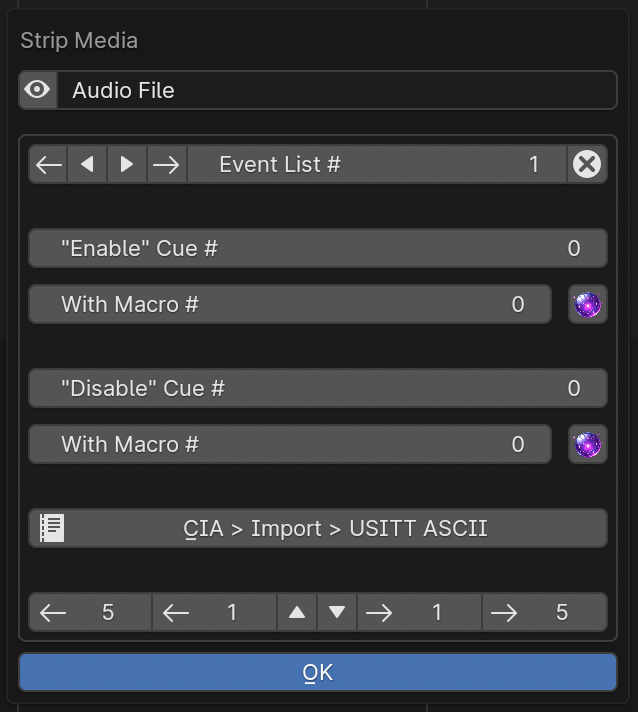

Toolbar tab
-----------------

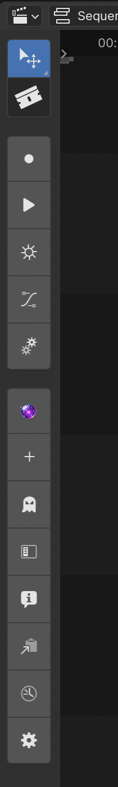

On the left, expand the toolbar tab for quick buttons. Consult the tooltips for details on each button. These currently only work for Eos. 

Sequencer hotkeys
---------------------------
**G, G + Y, G + X:** Grab. Add X or Y after to constrain to X or Y axis. This is a Blender feature.

**E:** Extrude. Extrude a pattern of exactly 2 strips.

**S:** Scale. Resize the spacing of selected strips.

**C:** Channel. Then enter the number of the channel you wish to move selected strips to, then Enter. What you type will be drawn in the header by Arm Strips like in a normal command line.

**F:** Format. Bring up the Strip Formatter popup.

**M:** Media. Bring up the Strip Media popup.

**D:** Deselect all.

**A:** Select all. This is a Blender feature.

**Spacebar:** Play. This is a Blender feature. 

**Shift + Spacebar:** Render Strips. This presses the button that deletes then recreates the event list on the console according to the strips inside the sequencer.

**Ctrl + G:** Ghost out. This presses the “Go_to_Cue Out Enter” on the console (Ghost button on toolbar.)

**Q:** Favorites. Right-click buttons to add to the Favorites menu. This is a Blender feature.

**L, Shift + L:** Left. Bump selected strips to the left one frame. Hold Shift to multiply by 5.

**R, Shift + R:** Right. Bump selected strips to the right one frame. Hold Shift to multiply by 5.

**U, Shift + U:** Up, Down. Bump selected strips up one channel. Hold Shift to go down instead.

**1-9, 0, Shift + 1-9:** Quickly select sequencer channels 1-9, 10, 11-19.

All of these settings put together is called a keymap. The entire keymap can be thoroughly customized in Blender’s Preferences, even those for Sorcerer buttons. Let’s everybody thank the Blender devs for this wonderful gift.

House lights automation
----------------------------

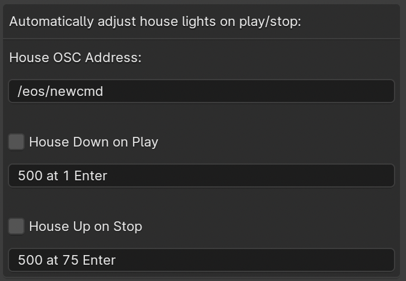

Accessed in the settings for sequencer, this feature allows you to have Sorcerer automatically dim and raise the house lights when you start and stop playback. This works on any lighting console with OSC input. Just type in the command you wish to send to dim the lights on playback and then type in the command you wish to send to raise the lights on stop. 

Livemap
--------------------
When working with the sequencer, especially when fine-tuning specific sections and repeatedly playing over the same part, a common problem is getting the stage set to where it needs to be to properly view the pertinent effect/animation/cue. Oftentimes the console is in the wrong cue unless you scrub all the way back just to fire that cue so you can properly see what you’re working on. Sorcerer’s Livemap feature addresses this by automatically firing the closest cue left of the scrub bar on play. 

It is interesting to note here that this is not a problem when creating sequences in the node editor. Another problem that vanishes when creating sequences in the node editor is the entire concept of “marking” movers in the dark to prevent lit moves. This is because the fundamental nature of keyframes makes it impossible for anything to not be in the correct position at the correct time. If a mover is keyframed to be in a specific position and dark to start going to a lit look, it is morally, ethically, spiritually, physically, positively, absolutely, undeniably and reliably bound to that position at that point in time. God himself could not change that. It would be absurd to be afraid that the mover might be in the focus palette from last cue and have to do a lit move if you didn’t mark it correctly. Keyframes make physically bind the mover to that position with ship anchors when you keyframe its start position. That’s what keyframes do. That’s why the entire concept of “marking” and the need for Livemap instantly vanishes when creating node editor animations.

Motif names and linking
----------------------------

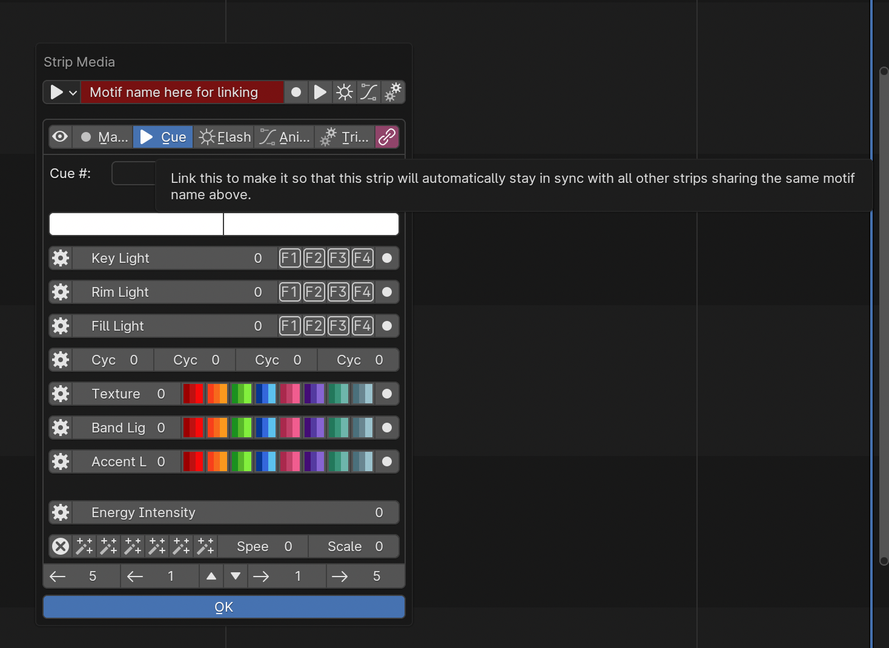

Motif names, the text field at the top of the Strip Media popup, is how you link similar nodes together so they stay in sync. To keep a group of strips in sync, use the Formatter and Copy to Selected button to make sure they all have the exact same Motif Name. Then make sure they all have their chain icon red and looking like a chain. This icon/button is to the right of the strip type buttons, so to the right of Trigger (or Animation if Trigger is turned off). Note: This does not keep all settings in sync.
